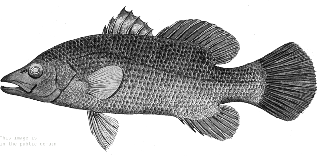
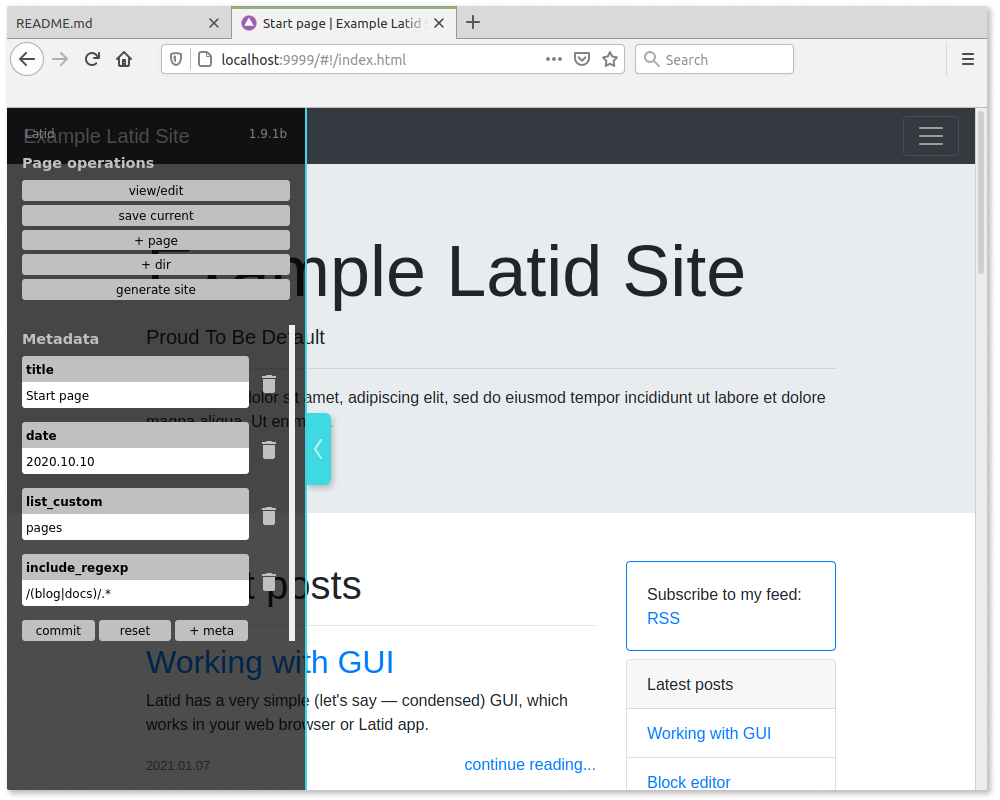

<h1 style='font-size:4rem'> Latid (L4)</h1>

Latid is a static site generator, which is [pretty damn simple in use](docs/en/required_knowledge.md).
It works as traditional command line utility and|or with browser based GUI (allowing to use block editor). 
It works best for multipage sites (tested with >2000 pages) with primary static 
(even completely javascript-free) content (blogs, documentation, portfolios).

It's now in active use by author (me), tested and is pretty mature.

([There are some docs](docs/en/index.md))

## Features

- One dependency (node.js), no install, just drop in
- Dead simple content management 
- Native JSON source file format, which is pretty semantic and can be used with other frontends
- Can use markdown source files as well
- Browser-based GUI
- Also works as command line utility
- Jamstack-friendly
- Nunjucks templates with all its might
- Tags, persistent and transient tag pages
- Relative links: easy URL change, viewable from local machine without server
- I18n ready
- Site may have any directory structure

 

## Requirements

You will need node.js, version 11 and up.

The sites, produced with Latid may be completely static and adapted even 
for oldest browsers, but you will need the descent one for using Latid GUI (Latid can 
  work without GUI with some limitations). 

Tested browsers: Firefox, version>68, Chrome, >77. Safari >12 _may_ also work. 

## Releases

### 1.9.4b

- Increased generation speed
- Handle server down situation with descriptive error message
- Themes support 
- More documentation
- Lots of errors and bugs fixed

### 1.9.3b

-  Improved documentation
-  Fixed some GUI flaws 
-  Custom default date for files without date
-  Custom sorting of lists
-  Improve example site contents (docs included)
-  List limits customization by page
-  Bugs fixed

### 1.9.2b

- Option to treat Markdown files without frontmatter as a source 
- Filter: sort views by any user-defined meta 
- Custom sorting of pages 
- Better block editor design
- New improved default site design
- Bugs fixed

## Plans 
<small>The marked ones are implemented, but will be included in future release</small>

- [ ] Better WYSIWYG in block editor
- [ ] Show better error screen when no page (404)
- [ ] Ability to create page, if it's linked, but do not exist on the fly
- [ ] Rework local server (cleaner API)
- [ ] _Table_ (csv?) article block
- [ ] ~~Working in browser without node.js~~ (looks impossible for now)
- [ ] Embed rendered page content to template

### Maybe plans

- [ ] Set local server port in site settings?

## How to start 

You have better to download latest release and unzip it, or build latid from repo.
It's strongly NOT recommended, but you can:

    git clone git@github.com:girobusan/latid.git
    cd latid 
    npm install
    npm run build_all

The output files now in the **dist** directory.

### Setup empty site

Open distribution folder. Rename the directories:

1. `_config.example` to `_config`
2. `src.example` to `src`

### Run server

Assuming you have node.js installed, execute from the same folder:

    node latidserv.js

Then point your browser to http://localhost:9999/ 

### Documentation

1. [Getting started](docs/en/gettingstarted.md)
2. [Config file](docs/en/settings_json.md)
2. [Site directory structure](docs/en/site_directory_structure.md)

[More...](docs/en/index.md) 

## When the "beta" status will end

There are goals, which must be achieved before removing "beta" status:

1. Finalization of block editor interface design
2. Stabilisation of latid server API (which is not stable now)
3. Clean up console output
4. Remove obsolete code

Other functionality is pretty usable. 

## Disclaimer

I'm not a real programmer, so the code is, probably, awful. There are some known problems, including, but not limited to:

- Too basic default site design (users have to develop they own)
- Incomplete documentation (in process)
- Custom JS may work quirky in GUI (affects only GUI preview, there are workarounds)

## Origin of name
**La·tid**  *noun* (zoology) — any member of the [Latidae family](https://en.wikipedia.org/wiki/Latidae).

## Image source

https://commons.wikimedia.org/wiki/File:Psammoperca_vaigiensis.jpg

This image is Crown Copyright because it is owned by the Australian Government 
or that of the states or territories, and is in the public domain because 
it was created or published prior to 1971 and the copyright has therefore 
expired. The government of Australia has declared that the expiration 
of Crown Copyrights applies worldwide.

