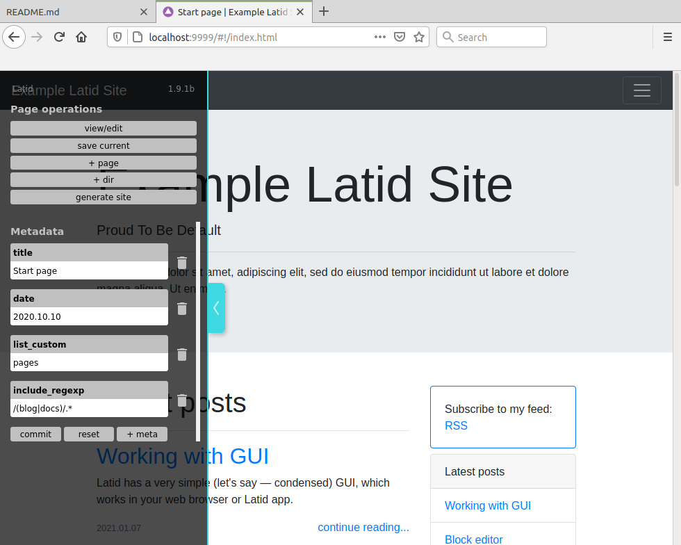

# Latid (L4) &#128031;

Latid is a static site generator, which works as traditional command line utility and|or with browser based GUI (allowing to use block editor). 

It supports _markdown_ source files alongside with it's own JSON format (pretty clean to parse and use with any custom scripts|apps). Works nicely with Jamstack providers like Netify and Amazon Amplify (both tested).

 

## Concepts & Features

- One dependency install (just drop files in and ensure you have node.js installed)
- Can work as regular command line utility
- Can work with markdown source files (you need to add frontmatter header with at least "title" field)
- Can also work in GUI mode in a browser, with the simplistic block editor
- JSON file format for pages created with block editor
- Nunjucks templates
- Tags 
- Site may have any directory structure 
- There is GUI app for working with the sites

## Planned features.
<small>The marked features are implemented, but will be included in future release</small>
- [ ] Ability to create page, if it's linked, but do not exist on the fly
- [ ] _Table_ (csv?) article block
- [ ] List limits customization by page
- [ ] Better GUI style
- [ ] Themes support
- [ ] Working in browser without node.js

## Releases

### 1.8.14b
- Bugs fixed
- Improved UI (error handling)
- Customize rendering of blocks via nunjucks
- _Markdown_ article block
- Custom (per site) default metadata for new files

## How to start 

You have better to download latest release and unsip it, or:

    git clone git@github.com:girobusan/latid.git
    cd latid 
    npm install
    npm run build_all

The output files now in the **dist** directory.

### Setup empty site

Open distribution folder. Rename the directories:

1. `_config.example` to `_config`
2. `src.example` to `src`

### Run server

Assuming you have node.js installed, execute from the same folder:

    node latidserv.js

Then point your browser to http://localhost:9999/ 

### Some other docs (so far)

1. [Getting started](docs/en/gettingstarted.md)
2. [Config file](docs/en/settings_json.md)
2. [Site directory structure](docs/en/site_directory_structure.md)
2. [On Markdown files](docs/en/markdown_src.md)
2. [On templates](docs/en/templates.md)
2. [Template variables](docs/en/template_vars.md)
2. ["View"](docs/en/view.md)
2. [Command line operation](docs/en/cli.md)
2. [Working with GUI](docs/en/gui.md)

## Disclaimer

I'm not a real programmer, so the code is, probably, awful. There are some known problems, including, but not limited to:

- Bad CSS isolation, styles may leak to GUI (fixing)
- Too basic default site design (users have to develop they own)
- Everything is on early stage
- Incomplete documentation (in process)
- Custom JS may work quirky in GUI (there are workarounds)

## Origin of name
**La·tid**  *noun* (zoology) — any member of the [Latidae family](https://en.wikipedia.org/wiki/Latidae).

