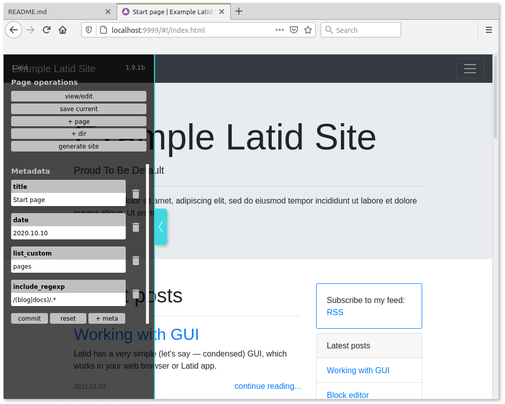

Latid is a static site generator, which works as traditional 
command line utility and|or with browser based GUI (allowing to use block editor). 
It works best for multipage sites (tested with >2000 pages) with primary static 
(even completely 
javascript-free) content (blogs, documentation, portfolios).

## Features

- One dependency (node.js), no install, just drop in
- Dead simple content management 
- Native JSON source file format, which is pretty semantic and can be used with other frontends
- Can use markdown source files as well
- Browser-based GUI
- Also works as command line utility
- Jamstack-friendly
- Nunjucks templates with all its might
- Tags, persistent and transient tag pages
- Relative links: easy URL change, viewable from local machine without server
- I18n ready
- Site may have any directory structure

 

## Requirements

You will need node.js, version 11 and up.

The sites, produced with Latid may be completely static and adapted even 
for oldest browsers, but you will need the descent one for using Latid GUI (Latid can 
  work without GUI with some limitations). 

Tested browsers: Firefox, version>68, Chrome, >77. Safari >12 may also work. 
