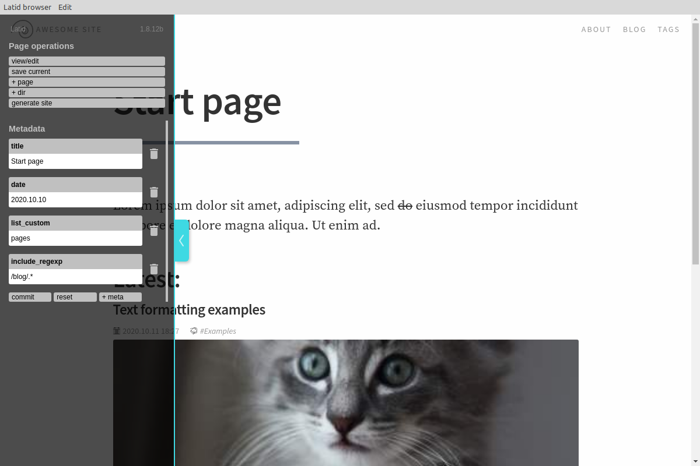
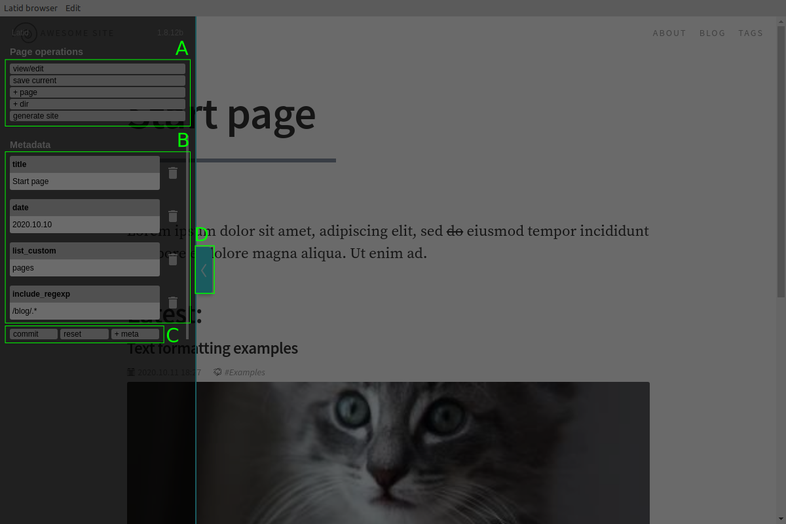
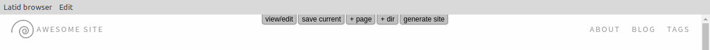

Latid has a very simple (let's say — condensed) GUI, which works in 
your web browser or Latid app.
<!--cut-->

GUI parts
---------
That how it looks the first time:

Let's break it down:

### A
Page operations. Switch to|from edit mode, save current page, create page in the current directory.

### B
Metadata editor. Here you edit and|or remove metadata.

### C
Metaeditor controls. When some metadata was edited, you need first commit your edit, and then save page with committed metadata. Reset removes all non-committed edits. Also you can add any metadata you want. Some meta is used by system, some may be used by your theme, for example.

### D
Panel switch. Also serves as indicator: when it's red, it means that there are unsaved edits. When you click on it, panel will hide, and buttons from (A) will move to the top of the page:

You can browse your site almost as usual, navigate to pages, edit them, create new and do other CMS things.
